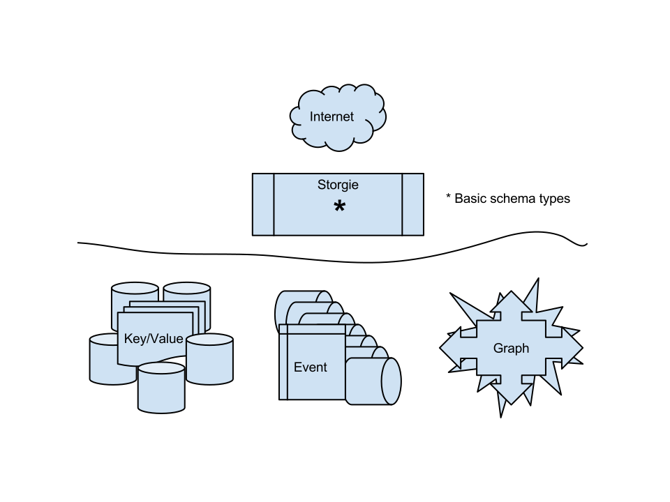
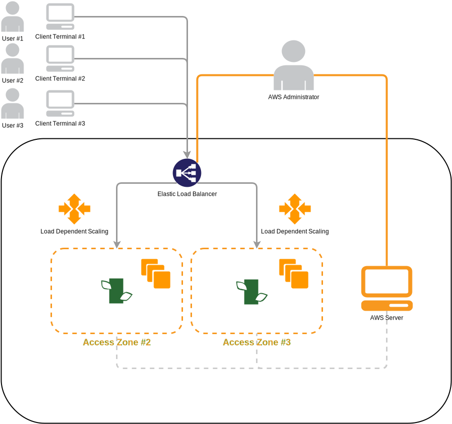

At a high level the Deconstructed Platform sits across a multi-region, multi-tier architecture that is setup to auto-scale compute, storage and other resources as needed. On the back end the platform uses a comobination of storage mechanisms that are also distributed, storing key value, graph and event series data. Currently these are the key storage types that provide the [consociation](/articles/consociation/) [(definition of consociation)](http://www.merriam-webster.com/dictionary/consociation) functionality the storage and retainment facilities the system needs.

The Deconstructed Platform is made up of multiple layers distributed across a number of multi-server nodes that can scale horizontally and vertically as demand is increased or decreased. These layers can be broken down vertically into logical layers, from top to bottom as:

 * Clients (Built, controlled, maintained or managed by clients or Deconstructed Inc.)
 * SDKs or access tooling to the Deconstructed APIs.
 * APIs and Real-time streams to provide read/write access and query to data.
 * Consociation Engine providing data collation, processing, logic and identity convergence.
 * Storgie is the storage facade that provides the logical data transfer style objects to, from and for the consociation.
 * Data storage. This is the tier providing key value, graph and event based storage to the system, specifically to Storgie.

Data Structures
===
The key data structures that underpin the storage system for the Deconstructed Platform include key value, graph and event storage. These mechanisms are provided to the Storgie data tier which provides them via APIs for client systems and for the [Consociation Engine](/articles/consociation/). The [Storgie Data Tier](/articles/storgie/)

</img>

</img>

</img>